# 📧 Outlook Email Manager with AI

מערכת ניהול מיילים ופגישות חכמה המשלבת Microsoft Outlook עם בינה מלאכותית לניתוח אוטומטי של חשיבות המיילים וניהול פגישות.

## 🌟 תכונות עיקריות

### 📧 ניהול מיילים חכם
- **ניתוח AI אוטומטי** - ניתוח חשיבות המיילים עם Gemini AI
- **סינון חכם** - מיילים קריטיים, חשובים, בינוניים ונמוכים
- **משוב משתמש** - מערכת למידה מהמשוב שלך
- **ניתוח קטגוריות** - זיהוי אוטומטי של סוגי מיילים

### 📅 ניהול פגישות
- **סינכרון Outlook** - טעינה אוטומטית של פגישות
- **כפתורי עדיפות** - סימון עדיפות פגישות עם LED חזותי
- **סטטיסטיקות** - ניתוח דפוסי פגישות
- **ניהול למידה** - מערכת למידה מתקדמת

### 🔌 תוסף Outlook
- **תוסף COM אמיתי** - אינטגרציה מלאה עם Outlook
- **ניתוח מיילים** - ניתוח מיילים ישירות מ-Outlook
- **ניתוח פגישות** - ניתוח פגישות ישירות מ-Outlook
- **ממשק אינטואיטיבי** - כפתורים ב-Ribbon של Outlook

### 🖥️ קונסול ניהול
- **מעקב בזמן אמת** - לוגים חיים של פעילות המערכת
- **ניהול שרת** - הפעלה מחדש וגיבויים
- **פרומפטים ל-Cursor** - יצירת קבצי עזר לפיתוח

## 🚀 התחלה מהירה

### דרישות מערכת
- Windows 10/11
- Python 3.8+
- Microsoft Outlook
- Google Gemini API Key

### התקנה מהירה
```powershell
# הפעלת הפרויקט
.\quick_start.ps1
```

### התקנת תוסף Outlook
```powershell
# התקנת תוסף COM
.\install_final_com_addin.bat

# או התקנת תוסף Office (Web Add-in)
.\install_office_addin.bat
```

### הפעלה ידנית
```powershell
# התקנת תלויות
pip install -r requirements.txt

# הפעלת השרת
python app_with_ai.py
```

### 🚀 התקנה מהירה לתוסף
- [📋 מדריך התקנה מהיר לתוסף](QUICK_START_OUTLOOK_ADDIN.md)

## 📁 מבנה הפרויקט

```mermaid
graph TD
    A[📧 Outlook Email Manager] --> B[🐍 Backend Flask]
    A --> C[🎨 Frontend HTML/CSS/JS]
    A --> D[🤖 AI Engine]
    A --> E[💾 Database]
    
    B --> B1[app_with_ai.py]
    B --> B2[ai_analyzer.py]
    B --> B3[user_profile_manager.py]
    B --> B4[config.py]
    
    C --> C1[📧 index.html]
    C --> C2[📅 meetings.html]
    C --> C3[🖥️ consol.html]
    
    D --> D1[Google Gemini API]
    D --> D2[AI Analysis]
    D --> D3[Learning System]
    
    E --> E1[email_manager.db]
    E --> E2[email_preferences.db]
    
    F[📚 Documentation] --> F1[README.md]
    F --> F2[INSTALLATION.md]
    F --> F3[USER_GUIDE.md]
    F --> F4[API_DOCUMENTATION.md]
    F --> F5[DEVELOPER_GUIDE.md]
    F --> F6[CHANGELOG.md]
```



### 📂 מבנה קבצים
```
outlook_email_manager/
├── 📧 app_with_ai.py          # אפליקציה ראשית
├── 🤖 ai_analyzer.py          # מנוע AI
├── 👤 user_profile_manager.py # ניהול פרופיל משתמש
├── 📄 config.py               # הגדרות
├── 📁 templates/              # תבניות HTML
│   ├── index.html            # דף ניהול מיילים
│   ├── meetings.html         # דף ניהול פגישות
│   └── consol.html           # דף קונסול
├── 📁 outlook_addin/          # תוסף Outlook
│   ├── manifest.xml          # מניפסט תוסף Office
│   ├── taskpane.html         # ממשק תוסף
│   └── assets/               # קבצי עזר
├── 🔌 outlook_com_addin_*.py # תוספי COM
├── 📁 docs/                  # תיעוד מפורט
├── 📁 Cursor_Prompts/        # פרומפטים לפיתוח
└── 📁 Old/                   # קבצים ישנים
```

## 📖 מדריכים מפורטים

- [📋 מדריך התקנה מפורט](docs/INSTALLATION.md)
- [👤 מדריך משתמש](docs/USER_GUIDE.md)
- [🔌 מדריך התקנה תוסף Outlook](docs/OUTLOOK_ADDIN_INSTALLATION.md)
- [🔌 מדריך משתמש תוסף Outlook](docs/OUTLOOK_ADDIN_USER_GUIDE.md)
- [🔧 מדריך מפתח](docs/DEVELOPER_GUIDE.md)
- [🔌 מדריך מפתח תוסף Outlook](docs/OUTLOOK_ADDIN_DEVELOPER_GUIDE.md)
- [🌐 תיעוד API](docs/API_DOCUMENTATION.md)
- [🔌 תיעוד API תוסף Outlook](docs/OUTLOOK_ADDIN_API_DOCUMENTATION.md)
- [📝 יומן שינויים](docs/CHANGELOG.md)
- [🔌 יומן שינויים תוסף Outlook](docs/OUTLOOK_ADDIN_CHANGELOG.md)

## 🔧 הגדרה

### 1. הגדרת Outlook
- התקן Microsoft Outlook
- התחבר לחשבון שלך
- הפעל את הפרויקט

### 2. הגדרת AI
- קבל API Key מ-Google Gemini
- הוסף את המפתח לקובץ `config.py`
- הפעל את המערכת

### 3. הגדרת בסיס נתונים
- המערכת יוצרת אוטומטית את בסיס הנתונים
- נתונים נשמרים ב-`email_manager.db`

## 🤝 תרומה לפרויקט

1. Fork את הפרויקט
2. צור branch חדש (`git checkout -b feature/amazing-feature`)
3. Commit את השינויים (`git commit -m 'Add amazing feature'`)
4. Push ל-branch (`git push origin feature/amazing-feature`)
5. פתח Pull Request

## 📝 רישיון

פרויקט זה מופץ תחת רישיון MIT. ראה קובץ `LICENSE` לפרטים נוספים.

## 📞 תמיכה

- 🐛 דיווח באגים: פתח Issue חדש
- 💡 הצעות תכונות: פתח Issue עם תווית "enhancement"
- 📧 שאלות: צור קשר דרך Issues

## 🏆 הישגים

- ✅ אינטגרציה מלאה עם Microsoft Outlook
- ✅ ניתוח AI מתקדם עם Gemini
- ✅ ממשק משתמש אינטואיטיבי
- ✅ מערכת למידה אדפטיבית
- ✅ ניהול פגישות חכם
- ✅ קונסול ניהול מתקדם
- ✅ תוסף COM אמיתי ל-Outlook
- ✅ תוסף Office (Web Add-in) ל-Outlook

---

**פותח עם ❤️ בישראל** 🇮🇱