# 🌐 תיעוד API מפורט

תיעוד מלא של כל ה-API endpoints ב-Outlook Email Manager with AI.

## 📋 סקירה כללית

המערכת מספקת REST API מלא לניהול מיילים, פגישות ו-AI analysis.

### תרשים API Endpoints

```mermaid
graph TD
    A[🌐 API Base URL: localhost:5000] --> B[📧 Email APIs]
    A --> C[📅 Meeting APIs]
    A --> D[🤖 AI APIs]
    A --> E[📊 Learning APIs]
    A --> F[🔧 System APIs]
    A --> G[🖥️ Console APIs]
    A --> H[📦 Backup APIs]
    
    B --> B1[GET /api/emails]
    B --> B2[POST /api/refresh-data]
    B --> B3[GET /api/stats]
    B --> B4[POST /api/user-feedback]
    B --> B5[POST /api/analyze-emails-ai]
    
    C --> C1[GET /api/meetings]
    C --> C2[POST /api/meetings/:id/priority]
    C --> C3[GET /api/meetings/stats]
    C --> C4[POST /api/analyze-meetings-ai]
    
    D --> D1[GET /api/ai-status]
    D --> D2[POST /api/analyze-emails-ai]
    D --> D3[POST /api/analyze-meetings-ai]
    
    E --> E1[GET /api/learning-stats]
    E --> E2[GET /api/learning-management]
    
    F --> F1[GET /api/test-outlook]
    F --> F2[GET /api/server-id]
    F --> F3[POST /api/restart-server]
    
    G --> G1[GET /api/console-logs]
    G --> G2[POST /api/clear-console]
    G --> G3[POST /api/console-reset]
    
    H --> H1[POST /api/create-backup]
    H --> H2[POST /api/create-cursor-prompts]
    H --> H3[POST /api/create-documentation]
```



**Base URL**: `http://localhost:5000`

**Content-Type**: `application/json`

## 📧 API מיילים

### GET /api/emails
מחזיר את כל המיילים מהזיכרון.

**Response**:
```json
[
  {
    "id": "email_123",
    "subject": "נושא המייל",
    "sender": "שולח",
    "sender_email": "sender@example.com",
    "received_time": "2025-09-30T10:30:00Z",
    "body_preview": "תצוגה מקדימה של התוכן...",
    "is_read": false,
    "importance_score": 0.85,
    "category": "work",
    "summary": "סיכום המייל",
    "action_items": ["פעולה 1", "פעולה 2"]
  }
]
```

### POST /api/refresh-data
מרענן את הנתונים מהזיכרון.

**Request**:
```json
{
  "type": "emails"  // או "meetings" או null לכל הנתונים
}
```

**Response**:
```json
{
  "success": true,
  "message": "נתונים עודכנו בהצלחה",
  "last_updated": "2025-09-30T10:35:00Z"
}
```

### GET /api/stats
מחזיר סטטיסטיקות מיילים.

**Response**:
```json
{
  "total_emails": 150,
  "unread_emails": 25,
  "critical_emails": 5,
  "high_priority_emails": 15,
  "medium_priority_emails": 50,
  "low_priority_emails": 80,
  "categories": {
    "work": 80,
    "personal": 40,
    "marketing": 20,
    "system": 10
  }
}
```

### POST /api/user-feedback
שולח משוב משתמש על ניתוח AI.

**Request**:
```json
{
  "email_id": "email_123",
  "feedback": "high",  // "high", "medium", "low"
  "ai_score": 0.85
}
```

**Response**:
```json
{
  "success": true,
  "message": "משוב נשמר בהצלחה"
}
```

### POST /api/analyze-emails-ai
מנתח מיילים נבחרים עם AI.

**Request**:
```json
{
  "emails": [
    {
      "id": "email_123",
      "subject": "נושא המייל",
      "sender": "שולח"
    }
  ]
}
```

**Response**:
```json
{
  "success": true,
  "message": "ניתוח AI הושלם",
  "updated_count": 5,
  "updated_emails": [
    {
      "id": "email_123",
      "ai_importance_score": 0.92,
      "ai_analyzed": true,
      "ai_analysis_date": "2025-09-29T10:35:00Z"
    }
  ]
}
```

## 📅 API פגישות

### GET /api/meetings
מחזיר את כל הפגישות מהזיכרון.

**Response**:
```json
[
  {
    "id": "meeting_456",
    "subject": "נושא הפגישה",
    "organizer": "מארגן",
    "organizer_email": "organizer@example.com",
    "start_time": "2025-09-30T14:00:00Z",
    "end_time": "2025-09-30T15:00:00Z",
    "location": "חדר ישיבות A",
    "attendees": ["participant1@example.com", "participant2@example.com"],
    "body": "תיאור הפגישה...",
    "importance_score": 0.75,
    "ai_analyzed": false,
    "priority": "medium"
  }
]
```

### POST /api/meetings/<meeting_id>/priority
מעדכן עדיפות פגישה.

**Request**:
```json
{
  "priority": "high"
}
```

**Response**:
```json
{
  "success": true,
  "message": "עדיפות עודכנה בהצלחה"
}
```

**Priority Values**:
- `critical` - קריטי
- `high` - חשוב
- `medium` - בינוני
- `low` - נמוך

### GET /api/meetings/stats
מחזיר סטטיסטיקות פגישות.

**Response**:
```json
{
  "total_meetings": 25,
  "critical_meetings": 3,
  "high_meetings": 6,
  "medium_meetings": 10,
  "low_meetings": 6,
  "today_meetings": 5,
  "week_meetings": 12
}
```

## 🤖 API AI

### GET /api/ai-status
מחזיר מצב מערכת ה-AI.

**Response**:
```json
{
  "ai_available": true,
  "use_ai": true,
  "api_key_configured": true,
  "last_check": "2025-09-29T10:30:00Z",
  "quota_remaining": 95
}
```

### POST /api/analyze-meetings-ai
מנתח פגישות נבחרות עם AI.

**Request**:
```json
{
  "meetings": [
    {
      "id": "meeting_456",
      "subject": "נושא הפגישה",
      "organizer": "מארגן"
    }
  ]
}
```

**Response**:
```json
{
  "success": true,
  "message": "ניתוח AI הושלם",
  "updated_count": 3,
  "updated_meetings": [
    {
      "id": "meeting_456",
      "ai_importance_score": 0.88,
      "ai_analyzed": true,
      "ai_analysis_date": "2025-09-29T10:35:00Z"
    }
  ]
}
```

## 🔧 API מערכת

### GET /api/test-outlook
בודק חיבור ל-Outlook.

**Response**:
```json
{
  "outlook_connected": true,
  "emails_count": 150,
  "meetings_count": 25,
  "last_check": "2025-09-29T10:30:00Z"
}
```

### GET /api/server-id
מחזיר מזהה ייחודי לשרת.

**Response**:
```json
{
  "server_id": "20250930_103000",
  "uptime": "2 hours 15 minutes",
  "version": "1.0.0"
}
```

### POST /api/restart-server
מפעיל מחדש את השרת.

**Response**:
```json
{
  "success": true,
  "message": "שרת הופעל מחדש",
  "restart_time": "2025-09-29T10:35:00Z"
}
```

## 🖥️ API קונסול

### GET /api/console-logs
מחזיר את הלוגים מהקונסול.

**Response**:
```json
{
  "logs": [
    "[10:30:00] INFO: Server started",
    "[10:30:15] SUCCESS: Outlook connected",
    "[10:30:30] INFO: AI analysis completed"
  ],
  "count": 50
}
```

### POST /api/clear-console
מנקה את הלוגים מהקונסול.

**Response**:
```json
{
  "success": true,
  "message": "קונסול נוקה בהצלחה"
}
```

### POST /api/console-reset
מאפס את הקונסול ומטען מחדש.

**Response**:
```json
{
  "success": true,
  "message": "קונסול אופס בהצלחה"
}
```

## 📦 API גיבויים

### POST /api/create-backup
יוצר גיבוי של הפרויקט.

**Request**:
```json
{
  "version_description": "גרסה יציבה"
}
```

**Response**:
```json
{
  "success": true,
  "message": "גיבוי נוצר בהצלחה",
  "backup_path": "C:\Users\user\Downloads\outlook_manager_backup_20250930.zip",
  "file_size": "15.2 MB"
}
```

### POST /api/create-cursor-prompts
יוצר קבצי פרומפטים ל-Cursor.

**Response**:
```json
{
  "success": true,
  "message": "פרומפטים נוצרו בהצלחה",
  "folder_path": "C:\Users\user\outlook_email_manager\Cursor_Prompts",
  "files_created": ["01_Main_Project_Prompt.txt", "02_Flask_Application.txt"]
}
```

### POST /api/create-documentation
יוצר/מרענן קבצי תיעוד MD.

**Response**:
```json
{
  "success": true,
  "message": "תיעוד נוצר בהצלחה",
  "folder_path": "C:\Users\user\outlook_email_manager\docs",
  "files_created": ["README.md", "INSTALLATION.md", "API_DOCUMENTATION.md"]
}
```

## 🔒 אבטחה

### Rate Limiting
- מקסימום 100 בקשות לדקה לכל IP
- מקסימום 10 בקשות AI לדקה

### Authentication
- כרגע אין אימות (פיתוח מקומי)
- בעתיד: JWT tokens או API keys

### CORS
- מותר מ-`localhost:5000` בלבד
- בעתיד: הגדרה גמישה יותר

## 📊 סטטוס קודים

| קוד | משמעות |
|-----|---------|
| 200 | הצלחה |
| 400 | בקשה שגויה |
| 404 | לא נמצא |
| 500 | שגיאת שרת |

## 🐛 טיפול בשגיאות

### שגיאות נפוצות
```json
{
  "success": false,
  "error": "outlook_not_connected",
  "message": "Outlook לא מחובר",
  "details": "נסה לפתוח את Outlook ולהפעיל מחדש"
}
```

### שגיאות AI
```json
{
  "success": false,
  "error": "ai_quota_exceeded",
  "message": "חרגת ממכסת ה-API",
  "details": "נסה שוב מאוחר יותר"
}
```

## 📈 ביצועים

### זמני תגובה ממוצעים
- GET /api/emails: 200ms
- POST /api/analyze-emails-ai: 2-5s
- GET /api/meetings: 150ms
- POST /api/refresh-data: 1-3s

### הגבלות
- מקסימום 500 מיילים לטעינה
- מקסימום 100 פגישות לטעינה
- מקסימום 10 מיילים לניתוח AI בו-זמנית

---

**תיעוד זה נוצר אוטומטית על ידי המערכת** 📚
