# 🌐 תיעוד API מפורט

תיעוד מלא של כל ה-API endpoints ב-Outlook Email Manager with AI.

## 📋 סקירה כללית

המערכת מספקת REST API מלא לניהול מיילים, פגישות ו-AI analysis.

### תרשים API Endpoints

```mermaid
graph TD
    A[🌐 API Base URL: localhost:5000] --> B[📧 Email APIs]
    A --> C[📅 Meeting APIs]
    A --> D[🤖 AI APIs]
    A --> E[📊 Learning APIs]
    A --> F[🔧 System APIs]
    A --> G[🖥️ Console APIs]
    A --> H[📦 Backup APIs]
    
    B --> B1[GET /api/emails]
    B --> B2[POST /api/refresh-data]
    B --> B3[GET /api/stats]
    B --> B4[POST /api/user-feedback]
    B --> B5[POST /api/analyze-emails-ai]
    
    C --> C1[GET /api/meetings]
    C --> C2[POST /api/meetings/:id/priority]
    C --> C3[GET /api/meetings/stats]
    C --> C4[POST /api/analyze-meetings-ai]
    
    D --> D1[GET /api/ai-status]
    D --> D2[POST /api/analyze-emails-ai]
    D --> D3[POST /api/analyze-meetings-ai]
    
    E --> E1[GET /api/learning-stats]
    E --> E2[GET /api/learning-management]
    
    F --> F1[GET /api/test-outlook]
    F --> F2[GET /api/server-id]
    F --> F3[POST /api/restart-server]
    
    G --> G1[GET /api/console-logs]
    G --> G2[POST /api/clear-console]
    G --> G3[POST /api/console-reset]
    
    H --> H1[POST /api/create-backup]
    H --> H2[POST /api/create-cursor-prompts]
```



**Base URL**: `http://localhost:5000`

**Content-Type**: `application/json`

## 📧 API מיילים

### GET /api/emails
מחזיר את כל המיילים מהזיכרון.

**Response**:
```json
[
  {
    "id": "email_123",
    "subject": "נושא המייל",
    "sender": "שולח",
    "sender_email": "sender@example.com",
    "body_preview": "תצוגה מקדימה...",
    "received_time": "2025-09-29T10:30:00Z",
    "is_read": false,
    "importance_score": 0.85,
    "ai_analyzed": true,
    "ai_importance_score": 0.92,
    "original_importance_score": 0.85,
    "ai_analysis_date": "2025-09-29T10:35:00Z",
    "summary": "סיכום AI...",
    "category": "work",
    "action_items": ["פעולה 1", "פעולה 2"]
  }
]
```

### POST /api/refresh-data
מרענן נתונים מ-Outlook.

**Request**:
```json
{
  "type": "emails"
}
```

**Response**:
```json
{
  "success": true,
  "message": "מיילים עודכנו בהצלחה",
  "last_updated": "2025-09-29T10:30:00Z",
  "count": 150
}
```

### GET /api/stats
מחזיר סטטיסטיקות מיילים.

**Response**:
```json
{
  "total_emails": 150,
  "important_emails": 38,
  "unread_emails": 25,
  "critical_emails": 15,
  "medium_emails": 60,
  "low_emails": 37
}
```

### POST /api/user-feedback
שולח משוב משתמש על מייל.

**Request**:
```json
{
  "email_data": {
    "id": "email_123",
    "subject": "נושא המייל",
    "sender": "שולח",
    "importance_score": 0.85
  },
  "feedback_type": "importance",
  "user_value": 0.9,
  "ai_value": 0.85
}
```

**Response**:
```json
{
  "success": true,
  "message": "משוב נרשם בהצלחה",
  "learning_updated": true
}
```

### POST /api/analyze-emails-ai
מנתח מיילים נבחרים עם AI.

**Request**:
```json
{
  "emails": [
    {
      "id": "email_123",
      "subject": "נושא המייל",
      "body_preview": "תוכן המייל...",
      "sender": "שולח"
    }
  ]
}
```

**Response**:
```json
{
  "success": true,
  "message": "ניתוח AI הושלם",
  "updated_count": 5,
  "updated_emails": [
    {
      "id": "email_123",
      "ai_importance_score": 0.92,
      "ai_analyzed": true,
      "ai_analysis_date": "2025-09-29T10:35:00Z"
    }
  ]
}
```

## 📅 API פגישות

### GET /api/meetings
מחזיר את כל הפגישות מהזיכרון.

**Response**:
```json
[
  {
    "id": "meeting_456",
    "subject": "נושא הפגישה",
    "organizer": "מארגן",
    "organizer_email": "organizer@example.com",
    "start_time": "2025-09-30T14:00:00Z",
    "end_time": "2025-09-30T15:00:00Z",
    "location": "חדר ישיבות A",
    "attendees": ["participant1@example.com", "participant2@example.com"],
    "body": "תיאור הפגישה...",
    "importance_score": 0.75,
    "ai_analyzed": false,
    "priority": "medium"
  }
]
```

### POST /api/meetings/<meeting_id>/priority
מעדכן עדיפות פגישה.

**Request**:
```json
{
  "priority": "high"
}
```

**Response**:
```json
{
  "success": true,
  "message": "עדיפות עודכנה בהצלחה"
}
```

**Priority Values**:
- `critical` - קריטי
- `high` - חשוב
- `medium` - בינוני
- `low` - נמוך

### GET /api/meetings/stats
מחזיר סטטיסטיקות פגישות.

**Response**:
```json
{
  "total_meetings": 25,
  "critical_meetings": 3,
  "high_meetings": 6,
  "medium_meetings": 10,
  "low_meetings": 6,
  "today_meetings": 5,
  "week_meetings": 12
}
```

## 🤖 API AI

### GET /api/ai-status
מחזיר מצב מערכת ה-AI.

**Response**:
```json
{
  "ai_available": true,
  "use_ai": true,
  "api_key_configured": true,
  "last_check": "2025-09-29T10:30:00Z",
  "quota_remaining": 95
}
```

### POST /api/analyze-meetings-ai
מנתח פגישות נבחרות עם AI.

**Request**:
```json
{
  "meetings": [
    {
      "id": "meeting_456",
      "subject": "נושא הפגישה",
      "body": "תיאור הפגישה...",
      "organizer": "מארגן"
    }
  ]
}
```

**Response**:
```json
{
  "success": true,
  "message": "ניתוח AI הושלם",
  "updated_count": 3,
  "updated_meetings": [
    {
      "id": "meeting_456",
      "ai_importance_score": 0.88,
      "ai_analyzed": true,
      "ai_analysis_date": "2025-09-29T10:35:00Z"
    }
  ]
}
```

## 📊 API למידה

### GET /api/learning-stats
מחזיר סטטיסטיקות מערכת הלמידה.

**Response**:
```json
{
  "learning_active": true,
  "total_feedback": 150,
  "total_patterns": 25,
  "accuracy_rate": 0.87,
  "last_learning": "2025-09-29T10:30:00Z",
  "email_patterns": 20,
  "meeting_patterns": 5
}
```

### GET /api/learning-management
מחזיר נתוני ניהול למידה מתקדמים.

**Response**:
```json
{
  "user_preferences": {
    "importance_threshold": 0.7,
    "category_preferences": {
      "work": 0.9,
      "personal": 0.3,
      "urgent": 0.95
    }
  },
  "learning_patterns": [
    {
      "pattern_type": "sender_importance",
      "pattern_data": {
        "sender": "boss@company.com",
        "average_importance": 0.92
      },
      "confidence": 0.95
    }
  ]
}
```

## 🔧 API מערכת

### GET /api/test-outlook
בודק חיבור ל-Outlook.

**Response**:
```json
{
  "success": true,
  "message": "Outlook זמין ופועל",
  "version": "Microsoft Outlook 2019",
  "account": "user@company.com"
}
```

### GET /api/server-id
מחזיר מזהה ייחודי של השרת.

**Response**:
```json
{
  "server_id": "server_789",
  "start_time": "2025-09-29T09:00:00Z",
  "uptime": "01:30:00"
}
```

### POST /api/restart-server
מפעיל את השרת מחדש.

**Response**:
```json
{
  "success": true,
  "message": "בקשת הפעלה מחדש נשלחה",
  "restart_time": "2025-09-29T10:35:00Z"
}
```

## 🖥️ API קונסול

### GET /api/console-logs
מחזיר לוגים מהקונסול.

**Query Parameters**:
- `t` - timestamp (אופציונלי)

**Response**:
```json
[
  "[10:30:15] INFO: מיילים נטענו מהזיכרון",
  "[10:30:20] SUCCESS: ניתוח AI הושלם",
  "[10:30:25] WARNING: AI quota נמוך"
]
```

### POST /api/clear-console
מנקה את לוגי הקונסול.

**Response**:
```json
{
  "success": true,
  "message": "לוגים נוקו מהשרת"
}
```

### POST /api/console-reset
מאפס את הקונסול לחלוטין.

**Response**:
```json
{
  "success": true,
  "message": "קונסול אופס בהצלחה"
}
```

## 📦 API גיבוי

### POST /api/create-backup
יוצר גיבוי של הפרויקט.

**Request**:
```json
{
  "version_description": "גרסה יציבה לפני עדכון"
}
```

**Response**:
```json
{
  "success": true,
  "message": "גיבוי נוצר בהצלחה",
  "filename": "outlook_email_manager_backup_20250929.zip",
  "size_mb": 15.2,
  "path": "C:\\Users\\ronni\\Downloads\\outlook_email_manager_backup_20250929.zip"
}
```

### POST /api/create-cursor-prompts
יוצר קבצי פרומפטים ל-Cursor.

**Response**:
```json
{
  "success": true,
  "message": "קבצי פרומפטים נוצרו בהצלחה",
  "folder_path": "C:\\Users\\ronni\\Downloads\\Cursor_Prompts",
  "files_created": [
    "01_Main_Project_Prompt.txt",
    "02_Flask_Application.txt",
    "03_Frontend_Development.txt",
    "04_Outlook_Integration.txt",
    "05_AI_Integration.txt",
    "06_Deployment.txt",
    "README.md"
  ]
}
```

## ⚠️ קודי שגיאה

### שגיאות נפוצות

**400 Bad Request**:
```json
{
  "error": "בקשה לא תקינה",
  "details": "פרמטרים חסרים או לא תקינים"
}
```

**404 Not Found**:
```json
{
  "error": "משאב לא נמצא",
  "details": "המייל או הפגישה לא קיימים"
}
```

**500 Internal Server Error**:
```json
{
  "error": "שגיאת שרת פנימית",
  "details": "שגיאה בעיבוד הבקשה"
}
```

**503 Service Unavailable**:
```json
{
  "error": "שירות לא זמין",
  "details": "Outlook או AI לא זמינים"
}
```

## 🔐 אבטחה

### אימות
כרגע המערכת פועלת ללא אימות. עבור ייצור מומלץ להוסיף:
- API Key authentication
- JWT tokens
- Rate limiting

### הגבלות
- **Rate Limiting**: 100 בקשות לדקה לכל IP
- **Timeout**: 30 שניות לכל בקשה
- **Payload Size**: מקסימום 10MB

## 📈 ביצועים

### אופטימיזציה
- **Caching**: נתונים נשמרים בזיכרון
- **Lazy Loading**: טעינה לפי דרישה
- **Batch Processing**: עיבוד קבוצתי

### ניטור
- **Response Time**: ממוצע < 200ms
- **Memory Usage**: ממוצע 50MB
- **CPU Usage**: ממוצע 5%

## 🧪 דוגמאות שימוש

### JavaScript (Frontend)
```javascript
// טעינת מיילים
async function loadEmails() {
  const response = await fetch('/api/emails');
  const emails = await response.json();
  return emails;
}

// שליחת משוב
async function sendFeedback(emailId, importance) {
  const response = await fetch('/api/user-feedback', {
    method: 'POST',
    headers: { 'Content-Type': 'application/json' },
    body: JSON.stringify({
      email_data: email,
      feedback_type: 'importance',
      user_value: importance,
      ai_value: email.importance_score
    })
  });
  return response.json();
}
```

### Python (Backend)
```python
import requests

# בדיקת סטטוס AI
response = requests.get('http://localhost:5000/api/ai-status')
ai_status = response.json()

# ניתוח מיילים עם AI
response = requests.post('http://localhost:5000/api/analyze-emails-ai', 
                        json={'emails': selected_emails})
result = response.json()
```

### PowerShell
```powershell
# בדיקת Outlook
$response = Invoke-RestMethod -Uri "http://localhost:5000/api/test-outlook" -Method GET
Write-Host $response.message

# יצירת גיבוי
$body = @{ version_description = "גיבוי יומי" } | ConvertTo-Json
$response = Invoke-RestMethod -Uri "http://localhost:5000/api/create-backup" -Method POST -Body $body -ContentType "application/json"
Write-Host "גיבוי נוצר: $($response.filename)"
```

---

**💡 טיפ**: השתמש ב-Developer Tools בדפדפן לבדיקת בקשות API!
