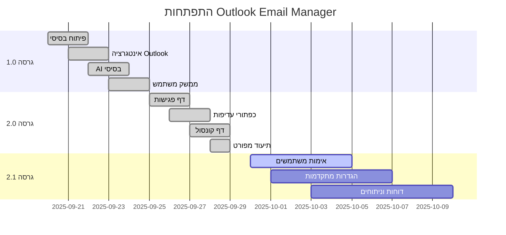

# 📝 יומן שינויים

כל השינויים המשמעותיים בפרויקט Outlook Email Manager with AI.

## [2.0.0] - 2025-09-29

### 📊 תרשים התפתחות הפרויקט

### ✨ תכונות חדשות
- **דף ניהול פגישות** - ניהול מלא של פגישות Outlook
- **כפתורי עדיפות פגישות** - סימון עדיפות עם LED חזותי
- **דף קונסול** - מעקב בזמן אמת אחר פעילות המערכת
- **מערכת גיבויים** - יצירת גיבויים אוטומטית
- **פרומפטים ל-Cursor** - קבצי עזר לפיתוח עם AI
- **ערכה כהה/בהירה** - החלפה בין ערכות נושא
- **ניתוח AI לפגישות** - ניתוח חשיבות פגישות עם Gemini

### 🔧 שיפורים
- **תצוגת מיילים מכווצים** - הקטנה מ-3 ל-2 שורות
- **כפתורי עדיפות משופרים** - אפקטים חזותיים מתקדמים
- **מערכת למידה** - למידה מתקדמת מהמשוב
- **ניווט משופר** - כפתורי מעבר בין דפים
- **סטטיסטיקות מפורטות** - נתונים מפורטים יותר
- **ביצועים משופרים** - אופטימיזציה של טעינה

### 🐛 תיקוני באגים
- **תיקון הודעות לוג** - הסרת מספרים לא ברורים
- **תיקון מיקום LED** - יישור מדויק של נורת הלד
- **תיקון אפקטים חזותיים** - מעבר חלק בין מצבים
- **תיקון גיבוי נתונים** - שמירה בטוחה של נתונים

### 📚 תיעוד
- **README.md מעודכן** - סקירה כללית מפורטת
- **INSTALLATION.md** - מדריך התקנה מפורט
- **USER_GUIDE.md** - מדריך משתמש מקיף
- **API_DOCUMENTATION.md** - תיעוד API מלא
- **DEVELOPER_GUIDE.md** - מדריך מפתחים מפורט

### 🗂️ ארגון קבצים
- **תיקיית docs/** - כל התיעוד במקום אחד
- **תיקיית Old/** - קבצים ישנים מועברים
- **ניקוי קוד** - הסרת קבצים מיותרים
- **ארגון templates** - הפרדת דפים שונים

## [1.0.0] - 2025-09-20

### ✨ תכונות ראשוניות
- **ניהול מיילים בסיסי** - טעינה והצגת מיילים
- **ניתוח AI בסיסי** - ניתוח חשיבות עם Gemini
- **מערכת משוב** - משוב על חשיבות וקטגוריות
- **ממשק משתמש** - דף ניהול מיילים
- **אינטגרציה Outlook** - חיבור ל-Microsoft Outlook
- **בסיס נתונים** - SQLite לנתונים

### 🔧 תכונות טכניות
- **Flask Application** - שרת web בסיסי
- **AI Integration** - חיבור ל-Google Gemini
- **Database Schema** - מבנה בסיס נתונים
- **Frontend** - HTML, CSS, JavaScript
- **Error Handling** - טיפול בשגיאות בסיסי

## 🚀 תכונות מתוכננות

### [2.1.0] - מתוכנן
- **אימות משתמשים** - מערכת הרשמה והתחברות
- **הגדרות מתקדמות** - התאמה אישית של המערכת
- **דוחות וניתוחים** - דוחות מפורטים על שימוש
- **אינטגרציה נוספת** - חיבור לשירותים נוספים

### [2.2.0] - מתוכנן
- **אפליקציה מובייל** - גרסה לנייד
- **API ציבורי** - API לשימוש חיצוני
- **תמיכה רב-שפתית** - תמיכה בשפות נוספות
- **התאמה לעסקים** - תכונות ארגוניות

### [3.0.0] - מתוכנן
- **AI מתקדם** - מודלים נוספים לניתוח
- **למידה עמוקה** - מערכת למידה מתקדמת
- **אוטומציה מלאה** - תגובות אוטומטיות
- **אינטגרציה ענן** - שמירה בענן

## 📊 סטטיסטיקות פיתוח

### קוד
- **שורות קוד**: ~15,000
- **קבצי Python**: 4
- **קבצי HTML**: 3
- **קבצי CSS**: 3 (מובנים ב-HTML)
- **קבצי JavaScript**: 3 (מובנים ב-HTML)

### תכונות
- **API Endpoints**: 25+
- **דפי Web**: 3
- **מסדי נתונים**: 2
- **תכונות AI**: 5+
- **אפקטים חזותיים**: 10+

### תיעוד
- **קבצי MD**: 6
- **דפי מדריך**: 5
- **דוגמאות קוד**: 50+
- **תמונות מסך**: 0 (מתוכנן)

## 🔄 תהליך עדכון

### עדכון מינורי (Patch)
- תיקוני באגים
- שיפורי ביצועים
- עדכוני תיעוד

### עדכון משמעותי (Minor)
- תכונות חדשות
- שיפורי UI/UX
- שיפורי API

### עדכון גדול (Major)
- שינויים ארכיטקטוניים
- שינויים ב-API
- שינויים במסד נתונים

## 📞 תמיכה

### דיווח באגים
- פתח Issue ב-GitHub
- כלול פרטי שגיאה
- הוסף צילומי מסך

### הצעות תכונות
- פתח Issue עם תווית "enhancement"
- תאר את התכונה המבוקשת
- הסבר את התועלת

### שאלות
- השתמש ב-Issues
- חפש בתשובות קיימות
- צור קשר עם המפתחים

---

**📅 עדכון אחרון**: 29 בספטמבר 2025  
**👨‍💻 מפתח**: Ronni  
**🌍 מיקום**: ישראל
