# 🔧 מדריך מפתחים מפורט

מדריך מקיף למפתחים המעוניינים לתרום או להתאים את Outlook Email Manager with AI.

## 🏗️ ארכיטקטורה

### תרשים זרימה כללי

```mermaid
flowchart TD
    A[👤 User] --> B[🌐 Web Browser]
    B --> C[📧 Email Management Page]
    B --> D[📅 Meeting Management Page]
    B --> E[🖥️ Console Page]
    
    C --> F[📧 Email List]
    C --> G[🤖 AI Analysis]
    C --> H[📊 Statistics]
    
    D --> I[📅 Meeting List]
    D --> J[🎯 Priority Buttons]
    D --> K[📈 Meeting Stats]
    
    E --> L[📝 Live Logs]
    E --> M[⚙️ System Controls]
    E --> N[💾 Backup Tools]
    
    F --> O[🐍 Flask Backend]
    G --> O
    H --> O
    I --> O
    J --> O
    K --> O
    L --> O
    M --> O
    N --> O
    
    O --> P[🤖 AI Analyzer]
    O --> Q[👤 User Profile Manager]
    O --> R[📊 Database]
    O --> S[📧 Outlook COM]
    
    P --> T[🧠 Google Gemini API]
    Q --> R
    R --> U[📧 email_manager.db]
    R --> V[👤 email_preferences.db]
    S --> W[📧 Microsoft Outlook]
```



### מבנה הפרויקט
```
outlook_email_manager/
├── 🐍 app_with_ai.py              # אפליקציה ראשית (Flask)
├── 🤖 ai_analyzer.py              # מנוע AI (Gemini)
├── 👤 user_profile_manager.py     # ניהול פרופיל משתמש
├── ⚙️ config.py                   # הגדרות מערכת
├── 📁 templates/                   # תבניות HTML
│   ├── index.html                 # דף ניהול מיילים
│   ├── meetings.html              # דף ניהול פגישות
│   └── consol.html                # דף קונסול
├── 📁 docs/                       # תיעוד
├── 📁 Cursor_Prompts/             # פרומפטים לפיתוח
├── 📁 Old/                        # קבצים ישנים
└── 📄 requirements.txt            # תלויות Python
```

### טכנולוגיות מרכזיות
- **Backend**: Flask (Python)
- **Frontend**: HTML5, CSS3, JavaScript (Vanilla)
- **AI**: Google Gemini API
- **Database**: SQLite
- **Integration**: Microsoft Outlook COM
- **Styling**: CSS Grid, Flexbox, Gradients

## 🐍 Backend Development

### Flask Application Structure

#### app_with_ai.py - האפליקציה הראשית
```python
from flask import Flask, render_template, jsonify, request
from ai_analyzer import AIAnalyzer
from user_profile_manager import UserProfileManager
import sqlite3
import win32com.client

app = Flask(__name__)

# Global instances
ai_analyzer = AIAnalyzer()
user_manager = UserProfileManager()
cached_data = {'emails': None, 'meetings': None}

# Routes
@app.route('/')
def index():
    return render_template('index.html')

@app.route('/api/emails')
def get_emails():
    # Implementation here
    pass
```

#### ai_analyzer.py - מנוע AI
```python
import google.generativeai as genai
from typing import List, Dict, Optional

class AIAnalyzer:
    def __init__(self):
        self.model = None
        self.api_key = None
        
    def configure(self, api_key: str):
        """הגדרת API Key"""
        pass
        
    def analyze_email_importance(self, email_data: Dict) -> float:
        """ניתוח חשיבות מייל"""
        pass
        
    def analyze_meeting_importance(self, meeting_data: Dict) -> float:
        """ניתוח חשיבות פגישה"""
        pass
```

#### user_profile_manager.py - ניהול פרופיל
```python
import sqlite3
from typing import Dict, List, Optional

class UserProfileManager:
    def __init__(self):
        self.db_path = "email_preferences.db"
        
    def save_feedback(self, email_data: Dict, feedback_type: str, 
                     user_value: any, ai_value: any):
        """שמירת משוב משתמש"""
        pass
        
    def get_learning_patterns(self) -> List[Dict]:
        """קבלת דפוסי למידה"""
        pass
```

### Database Schema

#### תרשים מסד נתונים


#### email_manager.db
```sql
-- טבלת מיילים
CREATE TABLE emails (
    id TEXT PRIMARY KEY,
    subject TEXT NOT NULL,
    sender TEXT NOT NULL,
    sender_email TEXT NOT NULL,
    body_preview TEXT,
    received_time DATETIME,
    is_read BOOLEAN DEFAULT FALSE,
    importance_score REAL DEFAULT 0.5,
    ai_analyzed BOOLEAN DEFAULT FALSE,
    ai_importance_score REAL,
    original_importance_score REAL,
    ai_analysis_date DATETIME,
    summary TEXT,
    category TEXT,
    action_items TEXT  -- JSON array
);

-- טבלת פגישות
CREATE TABLE meetings (
    id TEXT PRIMARY KEY,
    subject TEXT NOT NULL,
    organizer TEXT NOT NULL,
    organizer_email TEXT NOT NULL,
    start_time DATETIME,
    end_time DATETIME,
    location TEXT,
    attendees TEXT,  -- JSON array
    body TEXT,
    importance_score REAL DEFAULT 0.5,
    ai_analyzed BOOLEAN DEFAULT FALSE,
    priority TEXT DEFAULT 'medium'
);
```

#### email_preferences.db
```sql
-- טבלת משוב משתמש
CREATE TABLE user_feedback (
    id INTEGER PRIMARY KEY AUTOINCREMENT,
    email_id TEXT NOT NULL,
    feedback_type TEXT NOT NULL,  -- 'importance' or 'category'
    user_value TEXT NOT NULL,
    ai_value TEXT NOT NULL,
    timestamp DATETIME DEFAULT CURRENT_TIMESTAMP
);

-- טבלת דפוסי למידה
CREATE TABLE learning_patterns (
    id INTEGER PRIMARY KEY AUTOINCREMENT,
    pattern_type TEXT NOT NULL,
    pattern_data TEXT NOT NULL,  -- JSON
    confidence REAL DEFAULT 0.0,
    created_at DATETIME DEFAULT CURRENT_TIMESTAMP
);
```

## 🎨 Frontend Development

### HTML Structure

#### index.html - דף ניהול מיילים
```html
<!DOCTYPE html>
<html lang="he" dir="rtl">
<head>
    <meta charset="UTF-8">
    <meta name="viewport" content="width=device-width, initial-scale=1.0">
    <title>Outlook Email Manager</title>
    <style>
        /* CSS styles here */
    </style>
</head>
<body>
    <div class="container">
        <div class="header">
            <h1>📧 Outlook Email Manager</h1>
        </div>
        
        <div class="navigation">
            <!-- Navigation buttons -->
        </div>
        
        <div class="controls">
            <!-- Control buttons -->
        </div>
        
        <div class="stats">
            <!-- Statistics cards -->
        </div>
        
        <div class="emails-container">
            <!-- Email list -->
        </div>
    </div>
    
    <script>
        // JavaScript functionality
    </script>
</body>
</html>
```

### CSS Architecture

#### Responsive Design
```css
/* Mobile First Approach */
.container {
    max-width: 1200px;
    margin: 0 auto;
    padding: 20px;
}

/* Grid System */
.stats {
    display: grid;
    grid-template-columns: repeat(6, 1fr);
    gap: 15px;
}

/* Responsive Breakpoints */
@media (max-width: 1200px) {
    .stats { grid-template-columns: repeat(3, 1fr); }
}

@media (max-width: 768px) {
    .stats { grid-template-columns: repeat(2, 1fr); }
}

@media (max-width: 480px) {
    .stats { grid-template-columns: 1fr; }
}
```

#### Dark Mode Support
```css
/* Light Mode (Default) */
body {
    background: linear-gradient(135deg, #667eea 0%, #764ba2 100%);
    color: #333;
}

/* Dark Mode */
body.dark-mode {
    background: linear-gradient(135deg, #1a1a2e 0%, #16213e 100%);
    color: #e0e0e0;
}

body.dark-mode .email-item {
    background: #3d3d3d;
    border-color: #555;
}
```

### JavaScript Architecture

#### Module Pattern
```javascript
// Email Manager Module
const EmailManager = {
    allEmails: [],
    
    async loadEmails() {
        try {
            const response = await fetch('/api/emails');
            this.allEmails = await response.json();
            this.displayEmails(this.allEmails, 'emails-list');
            this.updateStatsFromEmails(this.allEmails);
        } catch (error) {
            this.showStatus('שגיאה בטעינת מיילים: ' + error.message, 'error');
        }
    },
    
    displayEmails(emails, containerId) {
        const container = document.getElementById(containerId);
        container.innerHTML = emails.map(email => this.createEmailHTML(email)).join('');
    },
    
    createEmailHTML(email) {
        return `
            <div class="email-item" id="email-${email.id}">
                <div class="email-header">
                    <span class="email-subject">${email.subject}</span>
                    <div class="importance-score ${this.getImportanceClass(email.importance_score)}">
                        ${this.getImportanceIcon(email.importance_score)} ${Math.round(email.importance_score * 100)}
                    </div>
                </div>
                <!-- More email content -->
            </div>
        `;
    }
};
```

#### Event Handling
```javascript
// Event Listeners
document.addEventListener('DOMContentLoaded', function() {
    EmailManager.loadEmails();
    MeetingManager.loadMeetings();
    ConsoleManager.startAutoRefresh();
});

// Button Event Handlers
function toggleEmail(emailId) {
    const emailElement = document.getElementById(`email-${emailId}`);
    emailElement.classList.toggle('collapsed');
}

async function giveImportanceFeedback(emailId, importance) {
    try {
        const email = EmailManager.allEmails.find(e => e.id === emailId);
        const response = await fetch('/api/user-feedback', {
            method: 'POST',
            headers: { 'Content-Type': 'application/json' },
            body: JSON.stringify({
                email_data: email,
                feedback_type: 'importance',
                user_value: importanceMap[importance],
                ai_value: email.importance_score
            })
        });
        
        const result = await response.json();
        if (result.success) {
            showStatus(`✅ נרשם משוב: ${importance}`, 'success');
        }
    } catch (error) {
        showStatus('שגיאה ברישום משוב: ' + error.message, 'error');
    }
}
```

## 🤖 AI Integration

### Gemini API Integration

#### Configuration
```python
import google.generativeai as genai
from typing import Dict, List, Optional

class AIAnalyzer:
    def __init__(self):
        self.model = None
        self.api_key = None
        
    def configure(self, api_key: str):
        """הגדרת Gemini API"""
        genai.configure(api_key=api_key)
        self.model = genai.GenerativeModel('gemini-pro')
        self.api_key = api_key
        
    def analyze_email_importance(self, email_data: Dict) -> float:
        """ניתוח חשיבות מייל עם AI"""
        prompt = f"""
        Analyze the importance of this email on a scale of 0-1:
        
        Subject: {email_data.get('subject', '')}
        Sender: {email_data.get('sender', '')}
        Content: {email_data.get('body_preview', '')}
        
        Consider:
        - Urgency indicators
        - Sender importance
        - Content relevance
        - Action required
        
        Return only a number between 0 and 1.
        """
        
        try:
            response = self.model.generate_content(prompt)
            importance = float(response.text.strip())
            return max(0.0, min(1.0, importance))  # Clamp between 0-1
        except Exception as e:
            print(f"AI Analysis Error: {e}")
            return 0.5  # Default importance
```

#### Batch Processing
```python
async def analyze_emails_batch(self, emails: List[Dict]) -> List[Dict]:
    """ניתוח קבוצתי של מיילים"""
    results = []
    
    for email in emails:
        try:
            importance = self.analyze_email_importance(email)
            email['ai_importance_score'] = importance
            email['ai_analyzed'] = True
            email['ai_analysis_date'] = datetime.now().isoformat()
            results.append(email)
        except Exception as e:
            print(f"Error analyzing email {email.get('id')}: {e}")
            
    return results
```

## 🔌 Outlook Integration

### COM Object Usage
```python
import win32com.client
from typing import List, Dict, Optional

class OutlookManager:
    def __init__(self):
        self.outlook = None
        self.namespace = None
        
    def connect(self):
        """התחברות ל-Outlook"""
        try:
            self.outlook = win32com.client.Dispatch("Outlook.Application")
            self.namespace = self.outlook.GetNamespace("MAPI")
            return True
        except Exception as e:
            print(f"Outlook Connection Error: {e}")
            return False
            
    def get_emails(self, folder_name: str = "Inbox", limit: int = 100) -> List[Dict]:
        """קבלת מיילים מ-Outlook"""
        try:
            folder = self.namespace.GetDefaultFolder(6)  # olFolderInbox
            messages = folder.Items
            messages.Sort("[ReceivedTime]", True)  # Sort by received time
            
            emails = []
            for i, message in enumerate(messages):
                if i >= limit:
                    break
                    
                email_data = {
                    'id': f"email_{message.EntryID}",
                    'subject': message.Subject or "",
                    'sender': message.SenderName or "",
                    'sender_email': message.SenderEmailAddress or "",
                    'body_preview': message.Body[:500] if message.Body else "",
                    'received_time': message.ReceivedTime.isoformat(),
                    'is_read': message.UnRead == False,
                    'importance_score': 0.5  # Default
                }
                emails.append(email_data)
                
            return emails
        except Exception as e:
            print(f"Error getting emails: {e}")
            return []
```

## 🧪 Testing

### Unit Tests
```python
import unittest
from unittest.mock import Mock, patch
from ai_analyzer import AIAnalyzer
from user_profile_manager import UserProfileManager

class TestAIAnalyzer(unittest.TestCase):
    def setUp(self):
        self.ai_analyzer = AIAnalyzer()
        
    def test_configure_api_key(self):
        """בדיקת הגדרת API Key"""
        self.ai_analyzer.configure("test-api-key")
        self.assertEqual(self.ai_analyzer.api_key, "test-api-key")
        
    @patch('google.generativeai.GenerativeModel')
    def test_analyze_email_importance(self, mock_model):
        """בדיקת ניתוח חשיבות מייל"""
        mock_response = Mock()
        mock_response.text = "0.85"
        mock_model.return_value.generate_content.return_value = mock_response
        
        email_data = {
            'subject': 'Important Meeting',
            'sender': 'Boss',
            'body_preview': 'Urgent meeting tomorrow'
        }
        
        importance = self.ai_analyzer.analyze_email_importance(email_data)
        self.assertEqual(importance, 0.85)

class TestUserProfileManager(unittest.TestCase):
    def setUp(self):
        self.user_manager = UserProfileManager()
        
    def test_save_feedback(self):
        """בדיקת שמירת משוב"""
        email_data = {'id': 'test_email', 'subject': 'Test'}
        result = self.user_manager.save_feedback(
            email_data, 'importance', 0.9, 0.7
        )
        self.assertTrue(result)

if __name__ == '__main__':
    unittest.main()
```

### Integration Tests
```python
import requests
import json

class TestAPIEndpoints(unittest.TestCase):
    def setUp(self):
        self.base_url = "http://localhost:5000"
        
    def test_get_emails(self):
        """בדיקת endpoint מיילים"""
        response = requests.get(f"{self.base_url}/api/emails")
        self.assertEqual(response.status_code, 200)
        self.assertIsInstance(response.json(), list)
        
    def test_user_feedback(self):
        """בדיקת שליחת משוב"""
        feedback_data = {
            'email_data': {'id': 'test', 'subject': 'Test'},
            'feedback_type': 'importance',
            'user_value': 0.9,
            'ai_value': 0.7
        }
        
        response = requests.post(
            f"{self.base_url}/api/user-feedback",
            json=feedback_data
        )
        self.assertEqual(response.status_code, 200)
```

## 🚀 Deployment

### Production Setup
```python
# Production configuration
class ProductionConfig:
    DEBUG = False
    TESTING = False
    SECRET_KEY = 'your-secret-key'
    DATABASE_URL = 'sqlite:///production.db'
    
    # AI Configuration
    GEMINI_API_KEY = 'your-production-api-key'
    USE_AI = True
    
    # Performance
    MAX_CONTENT_LENGTH = 16 * 1024 * 1024  # 16MB
    PERMANENT_SESSION_LIFETIME = 3600  # 1 hour
```

### Docker Configuration
```dockerfile
# Dockerfile
FROM python:3.9-slim

WORKDIR /app

COPY requirements.txt .
RUN pip install -r requirements.txt

COPY . .

EXPOSE 5000

CMD ["python", "app_with_ai.py"]
```

```yaml
# docker-compose.yml
version: '3.8'
services:
  outlook-manager:
    build: .
    ports:
      - "5000:5000"
    volumes:
      - ./data:/app/data
    environment:
      - FLASK_ENV=production
      - GEMINI_API_KEY=${GEMINI_API_KEY}
```

### Performance Optimization
```python
# Caching implementation
from functools import lru_cache
import time

class CachedDataManager:
    def __init__(self):
        self.cache = {}
        self.cache_timeout = 300  # 5 minutes
        
    @lru_cache(maxsize=128)
    def get_cached_emails(self, timestamp):
        """Cache emails with timestamp"""
        return self.fetch_emails_from_outlook()
        
    def is_cache_valid(self, key):
        """Check if cache is still valid"""
        if key not in self.cache:
            return False
        return time.time() - self.cache[key]['timestamp'] < self.cache_timeout
```

## 🔧 Debugging

### Logging Configuration
```python
import logging
from datetime import datetime

# Configure logging
logging.basicConfig(
    level=logging.INFO,
    format='%(asctime)s - %(name)s - %(levelname)s - %(message)s',
    handlers=[
        logging.FileHandler('app.log'),
        logging.StreamHandler()
    ]
)

logger = logging.getLogger(__name__)

# Usage in code
logger.info("Email analysis completed")
logger.error(f"AI API Error: {error}")
logger.debug(f"Debug info: {debug_data}")
```

### Error Handling
```python
def safe_api_call(func, *args, **kwargs):
    """Wrapper for safe API calls"""
    try:
        return func(*args, **kwargs)
    except Exception as e:
        logger.error(f"API call failed: {e}")
        return None

# Usage
result = safe_api_call(ai_analyzer.analyze_email_importance, email_data)
```

## 📊 Monitoring

### Health Checks
```python
@app.route('/health')
def health_check():
    """Health check endpoint"""
    health_status = {
        'status': 'healthy',
        'timestamp': datetime.now().isoformat(),
        'components': {
            'outlook': check_outlook_connection(),
            'ai': check_ai_availability(),
            'database': check_database_connection()
        }
    }
    return jsonify(health_status)
```

### Metrics Collection
```python
import time
from functools import wraps

def track_performance(func):
    """Decorator to track function performance"""
    @wraps(func)
    def wrapper(*args, **kwargs):
        start_time = time.time()
        result = func(*args, **kwargs)
        end_time = time.time()
        
        logger.info(f"{func.__name__} took {end_time - start_time:.2f} seconds")
        return result
    return wrapper

# Usage
@track_performance
def analyze_emails_with_ai(emails):
    return ai_analyzer.analyze_emails_batch(emails)
```

## 🤝 Contributing

### Code Style
- **PEP 8** compliance
- **Type hints** for all functions
- **Docstrings** for all classes and methods
- **Meaningful variable names**

### Git Workflow
```bash
# Feature development
git checkout -b feature/new-feature
git add .
git commit -m "Add new feature"
git push origin feature/new-feature

# Create Pull Request
```

### Code Review Checklist
- [ ] Code follows PEP 8
- [ ] Tests pass
- [ ] Documentation updated
- [ ] No hardcoded values
- [ ] Error handling implemented
- [ ] Performance considerations

---

**💡 טיפ**: השתמש ב-Cursor AI עם הפרומפטים ב-`Cursor_Prompts/` לפיתוח מהיר!
