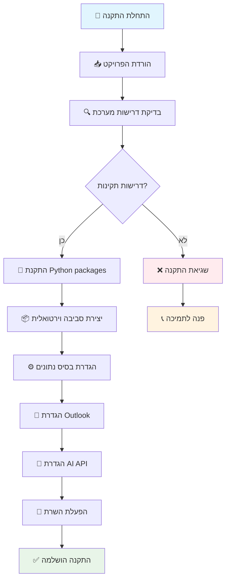

# 📋 מדריך התקנה מפורט

מדריך שלב אחר שלב להתקנת Outlook Email Manager with AI.

## 🔍 דרישות מערכת

### חומרה מינימלית
- **מעבד**: Intel i3 או AMD Ryzen 3 ומעלה
- **זיכרון**: 4GB RAM (מומלץ 8GB)
- **אחסון**: 2GB שטח פנוי
- **מערכת הפעלה**: Windows 10/11 (64-bit)

### תוכנה נדרשת
- **Python 3.8+** - [הורדה](https://www.python.org/downloads/)
- **Microsoft Outlook** - גרסה 2016 ומעלה
- **Git** - [הורדה](https://git-scm.com/downloads)
- **PowerShell 5.1+** (כבר מותקן ב-Windows 10/11)

## 🚀 התקנה מהירה (מומלץ)

### תרשים תהליך התקנה



### שלב 1: הורדת הפרויקט
```powershell
# פתח PowerShell כמנהל
git clone https://github.com/your-username/outlook-email-manager.git
cd outlook-email-manager
```

### שלב 2: הפעלה אוטומטית
```powershell
# הפעל את הסקריפט האוטומטי
.\quick_start.ps1
```

הסקריפט יבצע:
- ✅ בדיקת דרישות מערכת
- ✅ התקנת Python packages
- ✅ יצירת סביבה וירטואלית
- ✅ הגדרת בסיס נתונים
- ✅ הפעלת השרת

## 🔧 התקנה ידנית

### שלב 1: התקנת Python

1. **הורד Python** מ-[python.org](https://www.python.org/downloads/)
2. **התקן עם אפשרויות**:
   - ✅ "Add Python to PATH"
   - ✅ "Install for all users"
   - ✅ "Create shortcuts"

3. **בדוק התקנה**:
```powershell
python --version
pip --version
```

### שלב 2: יצירת סביבה וירטואלית

```powershell
# נווט לתיקיית הפרויקט
cd outlook-email-manager

# צור סביבה וירטואלית
python -m venv venv

# הפעל את הסביבה
.\venv\Scripts\Activate.ps1
```

### שלב 3: התקנת תלויות

```powershell
# התקן packages
pip install -r requirements.txt

# או התקן ידנית:
pip install flask
pip install python-dotenv
pip install google-generativeai
pip install pywin32
pip install requests
pip install sqlite3
```

### שלב 4: הגדרת Outlook

1. **התקן Microsoft Outlook**
2. **התחבר לחשבון**:
   - Exchange/Office 365
   - IMAP/POP3
   - Gmail (דרך IMAP)

3. **בדוק חיבור**:
```powershell
python -c "import win32com.client; print('Outlook זמין')"
```

### שלב 5: הגדרת AI (אופציונלי)

1. **קבל API Key** מ-[Google AI Studio](https://makersuite.google.com/app/apikey)
2. **צור קובץ config.py**:
```python
# config.py
GEMINI_API_KEY = "your-api-key-here"
USE_AI = True
```

### שלב 6: הפעלת השרת

```powershell
# הפעל את האפליקציה
python app_with_ai.py
```

## ⚙️ הגדרות מתקדמות

### הגדרת בסיס נתונים

המערכת יוצרת אוטומטית:
- `email_manager.db` - נתוני מיילים ופגישות
- `email_preferences.db` - העדפות משתמש

### הגדרת פורטים

```python
# app_with_ai.py
if __name__ == '__main__':
    app.run(host='0.0.0.0', port=5000, debug=True)
```

### הגדרת SSL (אופציונלי)

```python
# להפעלה עם HTTPS
app.run(ssl_context='adhoc')
```

## 🔧 פתרון בעיות נפוצות

### בעיה: "Python לא מזוהה"
```powershell
# פתרון: הוסף Python ל-PATH
# או השתמש בנתיב המלא:
C:\Python39\python.exe app_with_ai.py
```

### בעיה: "Module לא נמצא"
```powershell
# פתרון: התקן מחדש
pip install --upgrade pip
pip install -r requirements.txt --force-reinstall
```

### בעיה: "Outlook לא זמין"
```powershell
# פתרון: בדוק התקנה
Get-ItemProperty HKLM:\Software\Microsoft\Windows\CurrentVersion\Uninstall\* | Where-Object {$_.DisplayName -like "*Outlook*"}
```

### בעיה: "Port 5000 תפוס"
```powershell
# פתרון: שנה פורט
# או עצור תהליך:
netstat -ano | findstr :5000
taskkill /PID <PID> /F
```

### בעיה: "Gemini API שגיאה"
```python
# פתרון: בדוק API Key
import google.generativeai as genai
genai.configure(api_key="your-key")
model = genai.GenerativeModel('gemini-pro')
```

## 🧪 בדיקת התקנה

### בדיקה בסיסית
```powershell
# בדוק Python
python --version

# בדוק packages
python -c "import flask, google.generativeai; print('✅ כל ה-packages מותקנים')"

# בדוק Outlook
python -c "import win32com.client; print('✅ Outlook זמין')"
```

### בדיקה מלאה
```powershell
# הפעל בדיקה אוטומטית
python check_tables.py
```

## 📊 ביצועים מומלצים

### הגדרות אופטימליות
- **זיכרון**: הקצה 2GB ל-Python
- **CPU**: השתמש ב-4 cores
- **רשת**: חיבור יציב לאינטרנט (ל-AI)

### ניטור משאבים
```powershell
# בדוק שימוש בזיכרון
Get-Process python | Select-Object ProcessName, WorkingSet

# בדוק שימוש ב-CPU
Get-Process python | Select-Object ProcessName, CPU
```

## 🔄 עדכונים

### עדכון הפרויקט
```powershell
# משוך שינויים חדשים
git pull origin main

# עדכן packages
pip install -r requirements.txt --upgrade

# הפעל מחדש
python app_with_ai.py
```

### גיבוי נתונים
```powershell
# גבה בסיס נתונים
copy email_manager.db email_manager_backup.db
copy email_preferences.db email_preferences_backup.db
```

## 📞 תמיכה טכנית

אם נתקלת בבעיות:

1. **בדוק את הלוגים** ב-`templates/consol.html`
2. **פתח Issue** ב-GitHub עם פרטי השגיאה
3. **צור קשר** דרך Issues עם תווית "bug"

---

**💡 טיפ**: השתמש ב-`quick_start.ps1` להתקנה מהירה וקלה!
