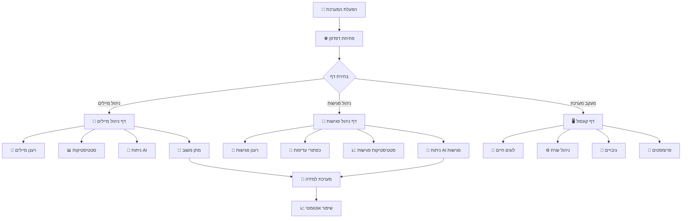

# 👤 מדריך משתמש מפורט

מדריך מקיף לשימוש ב-Outlook Email Manager with AI.

## 🏠 סקירה כללית

המערכת מורכבת משלושה דפים עיקריים:

### תרשים זרימת עבודה

### דפים עיקריים:
- **📧 ניהול מיילים** - ניתוח וניהול מיילים
- **📅 ניהול פגישות** - ניהול פגישות ועדיפויות
- **🖥️ קונסול** - מעקב וניהול מערכת

## 📧 דף ניהול מיילים

### 🎛️ כפתורי בקרה

#### כפתורי פעולה עיקריים
- **🔄 רענן מיילים** - טוען מיילים חדשים מ-Outlook
- **🔍 בדוק Outlook** - בודק חיבור ל-Outlook
- **🤖 סטטוס AI** - מציג מצב מערכת ה-AI
- **📊 סטטיסטיקות למידה** - מציג נתוני למידה
- **⚙️ ניהול למידה** - פותח דף ניהול למידה

#### כפתורי ניתוח
- **📁 כווץ/הרחב הכל** - כווץ או הרחב כל המיילים
- **🤖 ניתוח AI נבחרים** - ניתוח מיילים נבחרים עם AI

### 📊 סטטיסטיקות מיילים

המערכת מציגה 6 קטגוריות:

#### קטגוריות חשיבות
- **🚨 מיילים קריטיים** (10% הראשונים) - חשיבות 90%+
- **🔥 מיילים חשובים** (25% הבאים) - חשיבות 80%+
- **📌 מיילים בינוניים** (40% הבאים) - חשיבות 40-79%
- **📄 מיילים נמוכים** (25% האחרונים) - חשיבות פחות מ-40%

#### קטגוריות נוספות
- **📬 מיילים לא נקראו** - מיילים שלא נפתחו
- **📋 סה"כ מיילים** - כל המיילים במערכת

**💡 טיפ**: לחץ על כל קטגוריה כדי לראות רק את המיילים הרלוונטיים!

### 📧 הצגת מיילים

#### מצב מורחב (ברירת מחדל)
כל מייל מציג:
- **נושא המייל** + ציון חשיבות
- **שולח** + כתובת אימייל
- **תצוגה מקדימה** של התוכן
- **סיכום AI** (אם קיים)
- **קטגוריה** (אם זוהתה)
- **פעולות נדרשות** (אם זוהו)
- **כפתורי משוב** - חשוב/בינוני/לא חשוב
- **בחירת קטגוריה** - רשימה נפתחת
- **תאריך ושעה**

#### מצב מכווץ
- **שורה אחת**: נושא + ציון חשיבות + כפתור כווץ
- **שורה שנייה**: מידע קומפקטי (קטגוריה, תאריך, שולח)

**💡 טיפ**: לחץ על 📁 כדי לכווץ מייל בודד, או השתמש ב"כווץ הכל"

### 🤖 ניתוח AI

#### ניתוח אוטומטי
- מיילים חדשים מנותחים אוטומטית עם Gemini AI
- המערכת מזהה חשיבות, קטגוריה ופעולות נדרשות
- הציון מתעדכן בהתאם לניתוח

#### ניתוח ידני
1. **בחר מיילים** - סמן checkbox ליד "AI"
2. **לחץ "ניתוח AI נבחרים"**
3. **המתן** - הניתוח יכול לקחת כמה שניות
4. **צפה בתוצאות** - הציונים והקטגוריות יתעדכנו

#### השוואת ציונים
כשמייל מנותח עם AI, תראה:
- **ציון מקורי** - הציון הראשוני
- **ציון AI** - הציון החדש
- **שינוי** - חץ למעלה/למטה + אחוז השינוי

### 📝 מתן משוב

#### משוב על חשיבות
לחץ על אחד מהכפתורים:
- **⬆️ חשוב** - מעלה את הציון ל-90%
- **➡️ בינוני** - מעלה את הציון ל-50%
- **⬇️ לא חשוב** - מוריד את הציון ל-10%

**אפקט חזותי**:
1. כפתור הופך לירוק (לחיצה)
2. כפתור הופך לכתום (נבחר)
3. כפתור הופך לכחול עם ✓ (נשמר)

#### משוב על קטגוריה
בחר קטגוריה מהרשימה:
- **עבודה** - מיילים הקשורים לעבודה
- **אישי** - מיילים אישיים
- **דחוף** - מיילים דחופים
- **פגישה** - הזמנות פגישות
- **שיווק** - מיילים שיווקיים
- **מערכת** - הודעות מערכת

**💡 טיפ**: המשוב עוזר למערכת ללמוד מהעדפותיך!

## 📅 דף ניהול פגישות

### 🎛️ כפתורי בקרה

#### כפתורי פעולה עיקריים
- **🔄 רענן פגישות** - טוען פגישות חדשות מ-Outlook
- **🔍 בדוק Outlook** - בודק חיבור ל-Outlook
- **🤖 סטטוס AI** - מציג מצב מערכת ה-AI
- **📊 סטטיסטיקות למידה** - מציג נתוני למידה של פגישות
- **⚙️ ניהול למידה** - פותח דף ניהול למידה של פגישות

#### כפתורי ניתוח
- **📁 כווץ/הרחב הכל** - כווץ או הרחב כל הפגישות
- **🤖 ניתוח AI נבחרים** - ניתוח פגישות נבחרות עם AI

### 📊 סטטיסטיקות פגישות

המערכת מציגה 6 קטגוריות:

#### קטגוריות חשיבות
- **🚨 פגישות קריטיות** (10% הראשונות) - חשיבות 90%+
- **🔥 פגישות חשובות** (25% הבאות) - חשיבות 80%+
- **📌 פגישות בינוניות** (40% הבאות) - חשיבות 40-79%
- **📄 פגישות נמוכות** (25% האחרונות) - חשיבות פחות מ-40%

#### קטגוריות נוספות
- **📬 פגישות לא נקראו** - פגישות שלא נפתחו
- **📋 סה"כ פגישות** - כל הפגישות במערכת

### 📅 הצגת פגישות

#### מידע כללי
כל פגישה מציגה:
- **נושא הפגישה** + ציון חשיבות
- **מארגן** + כתובת אימייל
- **תאריך ושעה** - התחלה וסיום
- **מיקום** - חדר או מיקום פיזי
- **משתתפים** - רשימת משתתפים
- **תיאור** - פרטים נוספים

#### כפתורי עדיפות
לכל פגישה יש 4 כפתורי עדיפות:

- **🔴 קריטי** - פגישות דחופות וחשובות מאוד
- **🟠 חשוב** - פגישות חשובות
- **🟡 בינוני** - פגישות רגילות
- **🟢 נמוך** - פגישות לא דחופות

**אפקט חזותי**:
- **LED כחול** - דולק בכפתור הנבחר
- **מסגרת כחולה** - סביב הכפתור הנבחר
- **הילה כחולה** - אפקט זוהר סביב הכפתור

**💡 טיפ**: הכפתורים זוכרים את הבחירה שלך!

### 🤖 ניתוח AI לפגישות

#### ניתוח אוטומטי
- פגישות חדשות מנותחות אוטומטית
- המערכת מזהה חשיבות וקטגוריה
- הציון מתעדכן בהתאם לניתוח

#### ניתוח ידני
1. **בחר פגישות** - סמן checkbox ליד "AI"
2. **לחץ "ניתוח AI נבחרים"**
3. **המתן** - הניתוח יכול לקחת כמה שניות
4. **צפה בתוצאות** - הציונים והקטגוריות יתעדכנו

## 🖥️ דף קונסול

### 📊 מעקב בזמן אמת

הקונסול מציג:
- **לוגים חיים** - כל פעילות המערכת
- **הודעות שגיאה** - בעיות ופתרונות
- **הודעות הצלחה** - פעולות שהושלמו
- **אזהרות** - התראות חשובות

#### סוגי הודעות
- **🟢 SUCCESS** - פעולות שהושלמו בהצלחה
- **🔵 INFO** - מידע כללי
- **🟡 WARNING** - אזהרות חשובות
- **🔴 ERROR** - שגיאות שדורשות טיפול

### 🎛️ כפתורי בקרה

#### כפתורי ניהול
- **📜 גלילה אוטומטית** - גלילה אוטומטית לתחתית
- **🔄 איפוס קונסול** - איפוס מלא וטעינה מחדש
- **🗑️ נקה** - ניקוי הלוגים מהתצוגה
- **🔄 רענן** - טעינת לוגים חדשים

#### כפתורי מערכת
- **🚀 הפעל שרת מחדש** - הפעלה מחדש של השרת
- **📦 צור גיבוי** - יצירת גיבוי של הפרויקט
- **📝 פרומפטים ל-Cursor** - יצירת קבצי עזר לפיתוח

### 🔄 רענון אוטומטי

הקונסול מתעדכן אוטומטית כל 2 שניות:
- **הוספת לוגים חדשים** ללא ניקוי הקונסול
- **גלילה אוטומטית** לתחתית (אם מופעל)
- **זיהוי הפעלה מחדש** של השרת

## 🎨 ערכות נושא

### ערכה בהירה (ברירת מחדל)
- רקע בהיר ונקי
- צבעים עזים וברורים
- מתאים לעבודה ביום

### ערכה כהה
- רקע כהה ורגוע
- צבעים רכים לעיניים
- מתאים לעבודה בלילה

**💡 טיפ**: לחץ על 🌙/☀️ בפינה השמאלית העליונה להחלפה!

## ⌨️ קיצורי מקלדת

### ניווט
- **Tab** - מעבר בין שדות
- **Enter** - אישור בחירה
- **Escape** - ביטול פעולה

### פעולות מהירות
- **Ctrl+R** - רענון דף
- **Ctrl+F** - חיפוש בדף
- **Ctrl+Shift+R** - רענון מלא

## 🔧 פתרון בעיות נפוצות

### בעיה: מיילים לא נטענים
**פתרון**:
1. בדוק חיבור ל-Outlook
2. לחץ "רענן מיילים"
3. בדוק את הקונסול לשגיאות

### בעיה: AI לא עובד
**פתרון**:
1. בדוק "סטטוס AI"
2. ודא שיש API Key תקין
3. בדוק חיבור לאינטרנט

### בעיה: פגישות לא מוצגות
**פתרון**:
1. בדוק חיבור ל-Outlook
2. לחץ "רענן פגישות"
3. ודא שיש פגישות ביומן

### בעיה: הקונסול לא מתעדכן
**פתרון**:
1. בדוק "גלילה אוטומטית"
2. לחץ "רענן"
3. בדוק חיבור לשרת

## 💡 טיפים וטריקים

### יעילות מקסימלית
1. **השתמש בסינון** - עבוד רק עם מיילים רלוונטיים
2. **סמן מיילים חשובים** - השתמש בכפתורי עדיפות
3. **תן משוב** - עזור למערכת ללמוד
4. **השתמש ב-AI** - ניתוח אוטומטי חוסך זמן

### ניהול זמן
1. **התחל עם קריטיים** - מיילים ופגישות דחופות
2. **עבוד בקבוצות** - ניתוח מספר מיילים יחד
3. **השתמש בכיווץ** - ראה יותר מידע במסך אחד

### אופטימיזציה
1. **רענן באופן קבוע** - שמור על נתונים עדכניים
2. **בדוק סטטוס** - ודא שהכל עובד תקין
3. **עקוב אחר לוגים** - זהה בעיות מוקדם

---

**🎯 מטרה**: ניהול יעיל וחכם של מיילים ופגישות עם עזרת AI!
